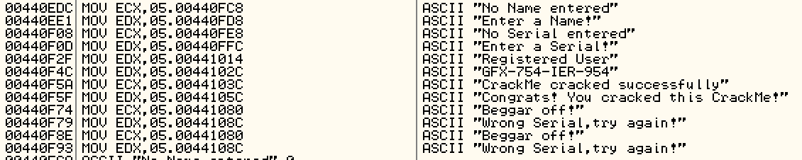

# codeengn.com BASIC 05

Q. 이 프로그램의 등록키는 무엇인가 

A. 파일을 실행해보면 등록키를 입력한 뒤 Register now! 버튼을 눌러 인증하는 프로그램이다.

odbg로 열어보면 무언가를 반복하는 루틴이 보인다. 압축된 것 같다.

UPX로 압축되어있다. 압축해제가 간단하니 풀자.

압축 해제 후 string을 살펴보면 

정답은 GFX-754-IER-954

+ 크랙해보자! 

HxD로 문자열 검색하면 바로 나오나 동적분석을 이용하겠다.

MessageBox를 보여주므로 모든 MessageBoxA 함수에 BP를 걸고 진행하면,

Regsiter now!를 클릭 시 0x43D146에서 걸린다. 이 근처가 등록키 체크 루틴인듯 하며, 이 함수의 출발점은 0x43D068이다.

Ctrl + F로 CALL 43D068을 검색해 보면...

겁나 수상하게 생긴 함수가 하나 나온다. 

찾아버렸다.

분기점 두개를 nop으로 바꾼 뒤 저장하면

